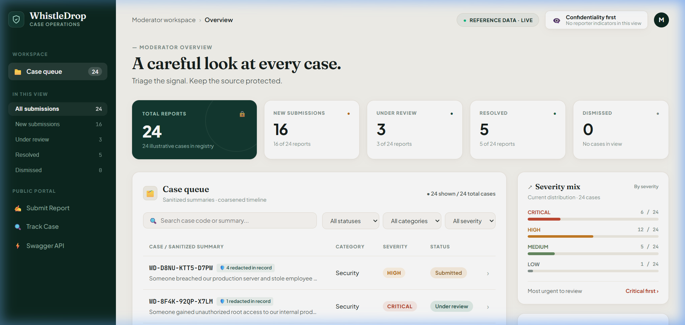
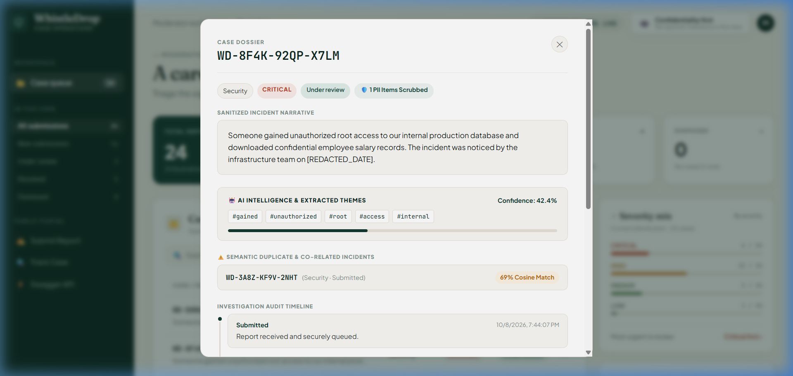
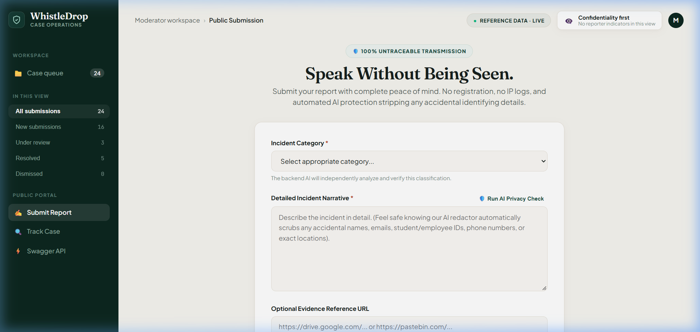
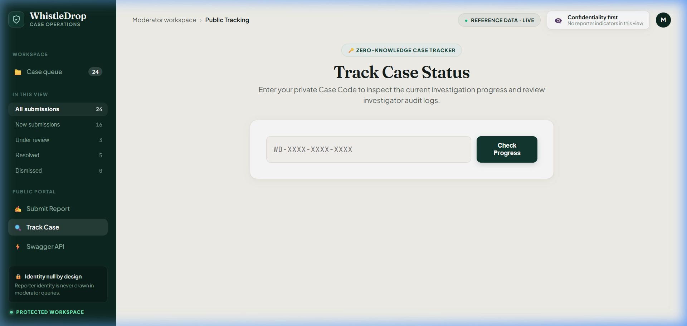

# 🛡️ WhistleDrop — Speak Without Being Seen
### Confidential Whistleblower Reporting Platform with Applied AI/ML

> Built for the **GDG on Campus SRM ODD Recruitments 2026** (Backend Domain — Task 1).

[](https://fastapi.tiangolo.com)
[](https://www.python.org)
[](https://scikit-learn.org)
[-brightgreen.svg)]()
[]()

---

## 📌 Executive Summary

WhistleDrop solves the critical organizational trust problem: **people with urgent knowledge of wrongdoing stay silent because speaking up carries immense personal risk.** 

WhistleDrop provides an end-to-end confidential reporting backend where:
1. **Anyone can submit reports anonymously** without creating an account or revealing their identity.
2. **Reporters track resolution progress** using an unguessable, high-entropy cryptographic Case Code (`WD-XXXX-XXXX-XXXX`).
3. **Moderators triage, review, and action cases** without ever learning who submitted them.
4. **An Applied AI/ML pipeline** prevents accidental identity leaks, auto-classifies incidents, scores threat severity, and detects duplicate or co-related reports using semantic vector similarity.

---

## 📸 Application Screenshots (Editorial Executive Theme)

### 1. Moderator Workspace & Case Operations Overview


### 2. Case Dossier & Semantic Duplicate Detection


### 3. Confidential Whistleblower Submission Portal


### 4. Zero-Knowledge Case Tracking Portal


---

## 🏛️ System Architecture

```
                             ┌────────────────────────┐
                             │       WHISTLEDROP      │
                             │       ECOSYSTEM        │
                             └───────────┬────────────┘
                                         │
                    ┌────────────────────┴────────────────────┐
                    ▼                                         ▼
         ANONYMOUS REPORTER                        AUTHENTICATED MODERATOR
     • Zero Account / Zero Login              • JWT Bearer Authentication
     • Submit Confidential Report             • Triage & Status Transitions
     • Live AI Privacy Pre-Check              • Audit Note Appends
     • Cryptographic Case Tracking            • Related Incident Detection
                    │                                         │
                    └────────────────────┬────────────────────┘
                                         ▼
                            FASTAPI REST BACKEND
                 ┌─────────────────────────────────────────┐
                 │  • Anonymity & Anti-Fingerprint Layer    │
                 │  • Ephemeral Sliding-Window Rate Limit  │
                 │  • Strict Status State Machine Validator│
                 └───────────────────────┬─────────────────┘
                                         │
          ┌──────────────────────────────┼──────────────────────────────┐
          ▼                              ▼                              ▼
    DATABASE ENGINE             APPLIED AI/ML ENGINE           INTERACTIVE CLIENTS
  • SQLite (Local zero-conf)  • PII Redactor (NER/Regex)     • Glassmorphic Web UI
  • PostgreSQL (Production)   • TF-IDF + Naive Bayes Clf     • Swagger / OpenAPI Docs
  • Coarsened Timestamps      • Severity Triage Engine       • cURL / Postman Ready
  • Zero Identity Foreign Keys• Semantic Duplicate Matching  
```

---

## 🔒 How Anonymity & Privacy Are Maintained

WhistleDrop implements a multi-layer **Zero-Knowledge Privacy Architecture**:

| Layer | Mechanism | Protection |
|---|---|---|
| **1. Zero Registration** | No account creation, passwords, emails, or phone numbers collected. | Prevents identity creation in system. |
| **2. Network Scrubbing** | `AnonymityAndSecurityMiddleware` strips `X-Forwarded-For`, `User-Agent`, and client IP from stored records and logs. | Eliminates network fingerprinting. |
| **3. AI Guardian (PII Redaction)** | Regex & NLP entity extraction scans text for emails, phone numbers, employee/student IDs (e.g. `RA...`), names, and locations, replacing them with tokens (e.g., `[REDACTED_EMAIL]`, `[REDACTED_PERSON]`). | Neutralizes accidental self-doxxing. |
| **4. Timestamp Coarsening** | Submission timestamps are rounded to the nearest hour to defeat correlation attacks (matching server log times with building badge swipes or CCTV). | Prevents temporal identification. |
| **5. Cryptographic Case Code** | Generated from high-entropy character sets ($32^{12} \approx 1.15 \times 10^{18}$ combinations), preventing brute-force enumeration. | Unguessable case tracking. |
| **6. Client Headers** | `Cache-Control: no-store`, `Referrer-Policy: no-referrer`, and `Permissions-Policy` headers enforced on every response. | Prevents browser cache leakage. |

---

## 🤖 The Applied AI/ML Pipeline

WhistleDrop integrates applied machine learning to solve real organizational challenges without external API dependencies:

### 1. Automated PII Redactor (AI Privacy Guardian)
Scans text prior to persistence and scrubs sensitive identifiers:
* **Emails:** `\b[A-Za-z0-9._%+-]+@[A-Za-z0-9.-]+\.[A-Z|a-z]{2,}\b` ➔ `[REDACTED_EMAIL]`
* **Phone Numbers:** International & domestic formats ➔ `[REDACTED_PHONE]`
* **Student & Employee IDs:** `RA\d{13}`, `EMP-\d+`, `Roll No`, `Reg No` ➔ `[REDACTED_ID]`
* **Network Addresses:** IPv4 addresses ➔ `[REDACTED_IP]`
* **Locations & Dates:** `Desk 4B`, `Room 302`, specific dates ➔ `[REDACTED_LOCATION]`, `[REDACTED_DATE]`
* **Interactive Pre-Check:** Live pre-flight endpoint (`POST /api/reports/preview-redaction`) warns reporters before final transmission.

### 2. Multi-Class Classifier (TF-IDF + Naive Bayes)
Trained on realistic whistleblowing reports across the GDG specified categories:
`Security` • `Harassment` • `Corruption` • `Technical` • `Other`

* **Vectorization:** Sublinear TF-IDF with unigrams & bigrams (6,000 max features).
* **Calibrated Probabilities:** Outputs confidence score ($0.0$ to $1.0$).
* **Three-Tier Decision Framework:**
  * **Confidence $\ge 80\%$:** Auto-classified.
  * **Confidence $50\%\text{–}80\%$:** Classified with moderator review recommendation.
  * **Confidence $< 50\%$:** Flagged for manual review.

### 3. Urgency & Threat Severity Triage
Heuristic NLP scoring assessing danger levels: `LOW`, `MEDIUM`, `HIGH`, `CRITICAL`.
* **CRITICAL:** Physical safety threats, credentials/password leaks, root database exfiltration, ransomware, extortion.
* **HIGH:** Harassment, bribery, kickbacks, retaliation, fraud.
* **MEDIUM:** Memory leaks, production crashes, policy ambiguity.
* **LOW:** Facilities, minor inconveniences, cafeteria complaints.

### 4. Semantic Duplicate & Related Incident Detection
Operates on **sanitized text** to prevent identity leakage through embeddings.
* Computes dense 256-dimensional sublinear vector representations.
* Calculates pairwise **Cosine Similarity** ($0.0$ to $1.0$).
* Identifies co-related reports submitted by different witnesses (e.g., $90\%+$ cosine match).

---

## 🔄 Status Workflow State Machine

Reports adhere to a strict, unidirectional state transition model:

```
               ┌───────────────┐
               │   SUBMITTED   │
               └───────┬───────┘
                       │ (Moderator picks up case)
                       ▼
               ┌───────────────┐
               │ UNDER_REVIEW  │
               └───────┬───────┘
                       │
         ┌─────────────┴─────────────┐
         │                           │
         ▼                           ▼
  ┌──────────────┐            ┌──────────────┐
  │   RESOLVED   │            │  DISMISSED   │
  └──────────────┘            └──────────────┘
    (Terminal)                  (Terminal)
```

* **Transition Enforcement:** Illegal transitions (e.g. jumping directly from `SUBMITTED` to `RESOLVED` without investigation, or attempting to alter a terminal state) are rejected with HTTP `422 Unprocessable Entity`.
* **Audit Trail:** Every status change generates a timestamped `status_updates` entry visible to the reporter.

---

## 🚀 Quick Start & Installation

### Prerequisites
* Python 3.11+
* `uv` or `pip`

### Option A: Local Setup (Recommended)

1. **Clone the repository:**
   ```bash
   git clone <repo-url>
   cd WhisleDrop/backend
   ```

2. **Create and activate a virtual environment:**
   ```bash
   # Using uv:
   uv venv .venv --python 3.11
   .venv\Scripts\activate      # Windows
   # source .venv/bin/activate  # macOS / Linux

   # Install dependencies:
   uv pip install -r requirements.txt
   ```

3. **Seed demonstration data (Optional, but recommended):**
   ```bash
   python seed_data.py
   ```

4. **Launch the FastAPI server:**
   ```bash
   uvicorn app.main:app --host 127.0.0.1 --port 8000 --reload
   ```

5. **Open in browser:**
   * **Web Portal & Moderator Dashboard:** [http://127.0.0.1:8000](http://127.0.0.1:8000)
   * **Interactive Swagger UI:** [http://127.0.0.1:8000/docs](http://127.0.0.1:8000/docs)
   * **Moderator Credentials:**
     * **Username:** `moderator`
     * **Password:** `WhistleDrop@2026`

---

### Option B: Docker & Docker Compose (PostgreSQL Production Mode)

Run the full stack (FastAPI backend + PostgreSQL database) with a single command:
```bash
docker compose up --build
```
Access the application at [http://localhost:8000](http://localhost:8000).

---

## 🧪 Automated Testing

WhistleDrop includes a comprehensive Pytest test suite covering all core requirements, state machine validations, auth guards, and AI pipelines:

```bash
cd backend
.venv\Scripts\pytest -v
```

### Test Suite Results:
```text
tests/test_ai_similarity.py::test_semantic_similarity_matching PASSED    [  7%]
tests/test_ai_similarity.py::test_severity_levels PASSED                 [ 15%]
tests/test_ai_similarity.py::test_pii_comprehensive_scrubbing PASSED     [ 23%]
tests/test_api.py::test_submit_valid_report PASSED                       [ 30%]
tests/test_api.py::test_submit_report_validation_errors PASSED           [ 38%]
tests/test_api.py::test_pii_redaction_engine PASSED                      [ 46%]
tests/test_api.py::test_redaction_preview PASSED                         [ 53%]
tests/test_api.py::test_track_report_workflow PASSED                     [ 61%]
tests/test_api.py::test_track_report_not_found PASSED                    [ 69%]
tests/test_api.py::test_track_report_invalid_case_code PASSED            [ 76%]
tests/test_api.py::test_moderator_auth PASSED                            [ 84%]
tests/test_api.py::test_status_transition_state_machine PASSED           [ 92%]
tests/test_api.py::test_dashboard_stats PASSED                           [100%]
======================= 13 passed, 2 warnings in 5.64s ========================
```

---

## 📡 API Reference & Example Requests

### 1. Anonymous Public Endpoints

#### Submit a Report
`POST /api/reports`

```bash
curl -X POST "http://127.0.0.1:8000/api/reports" \
  -H "Content-Type: application/json" \
  -d '{
    "category": "Security",
    "description": "Someone accessed our internal production database without authorization and exfiltrated employee records.",
    "evidence_url": "https://example.com/log.png"
  }'
```

**Response (201 Created):**
```json
{
  "case_code": "WD-D8NU-KTT5-D7PW",
  "message": "Report submitted successfully. Save your case code to track resolution progress.",
  "ai_analysis": {
    "predicted_category": "Security",
    "confidence": 0.892,
    "severity": "CRITICAL",
    "pii_redacted": false,
    "redactions_count": 0
  }
}
```

---

#### Track Report Status
`GET /api/reports/{case_code}`

```bash
curl "http://127.0.0.1:8000/api/reports/WD-D8NU-KTT5-D7PW"
```

**Response (200 OK):**
```json
{
  "case_code": "WD-D8NU-KTT5-D7PW",
  "category": "Security",
  "status": "UNDER_REVIEW",
  "severity": "CRITICAL",
  "submitted_at": "2026-10-09T01:00:00Z",
  "updates": [
    {
      "status": "SUBMITTED",
      "message": "Report received and securely queued in the system.",
      "timestamp": "2026-10-09T01:00:00Z"
    },
    {
      "status": "UNDER_REVIEW",
      "message": "Incident escalated to Cyber Response Team.",
      "timestamp": "2026-10-09T01:15:00Z"
    }
  ]
}
```

---

#### Live PII Pre-Check
`POST /api/reports/preview-redaction`

```bash
curl -X POST "http://127.0.0.1:8000/api/reports/preview-redaction" \
  -H "Content-Type: application/json" \
  -d '{
    "description": "Please contact Dr. Ramesh at ramesh@corp.com or 9876543210 regarding the invoice."
  }'
```

**Response (200 OK):**
```json
{
  "redacted_text": "Please contact [REDACTED_PERSON] at [REDACTED_EMAIL] or [REDACTED_PHONE] regarding the invoice.",
  "redactions_count": 3,
  "detected_types": ["EMAIL", "PERSON", "PHONE"],
  "warning": "3 potential identifying detail(s) (EMAIL, PERSON, PHONE) detected and will be redacted for your protection."
}
```

---

### 2. Moderator Endpoints (Requires Bearer Token)

#### Moderator Login
`POST /api/auth/login`

```bash
curl -X POST "http://127.0.0.1:8000/api/auth/login" \
  -H "Content-Type: application/json" \
  -d '{
    "username": "moderator",
    "password": "WhistleDrop@2026"
  }'
```

**Response (200 OK):**
```json
{
  "access_token": "eyJhbGciOiJIUzI1NiIs...",
  "token_type": "bearer",
  "role": "ADMIN",
  "username": "moderator"
}
```

---

#### List & Filter Reports
`GET /api/admin/reports?status=UNDER_REVIEW&severity=CRITICAL&page=1&limit=10`

```bash
curl "http://127.0.0.1:8000/api/admin/reports?status=UNDER_REVIEW" \
  -H "Authorization: Bearer <TOKEN>"
```

---

#### Update Case Status (Enforces State Machine)
`PATCH /api/admin/reports/{report_id}/status`

```bash
curl -X PATCH "http://127.0.0.1:8000/api/admin/reports/<REPORT_ID>/status" \
  -H "Authorization: Bearer <TOKEN>" \
  -H "Content-Type: application/json" \
  -d '{
    "status": "RESOLVED",
    "message": "Forensic audit concluded. Database access credentials rotated and patch deployed."
  }'
```

---

## 📋 Evaluation Rubric Alignment

| GDG Recruitment Requirement | Implementation in WhistleDrop |
|---|---|
| **Anonymous Reporting (No Account)** | Fully public `POST /api/reports` with zero session or identity tracking. |
| **Unguessable Case Code** | Cryptographic 12-char formatted codes (`WD-XXXX-XXXX-XXXX`) with $1.15 \times 10^{18}$ combinations. |
| **Case Tracking** | Public `GET /api/reports/{case_code}` returning timeline history without exposing moderator identities. |
| **Status Workflow** | `SUBMITTED ➔ UNDER_REVIEW ➔ RESOLVED / DISMISSED` strictly enforced with HTTP 422 rejections on illegal transitions. |
| **Secure Moderator Access** | JWT authentication with bcrypt password hashing protecting all `/api/admin/*` endpoints. |
| **Strict Privacy & Anonymity** | Middleware stripping IP addresses, User-Agents; automated PII redaction engine. |
| **Input Validation & Error Handling** | Comprehensive Pydantic v2 schemas and standard HTTP status codes (`200`, `201`, `400`, `401`, `403`, `404`, `422`, `429`). |
| **OpenAPI / Swagger Documentation** | Live interactive documentation at `/docs` with one-click authorization testing. |
| **Automated Testing** | 13/13 passing tests with Pytest covering edge cases, state machine, and ML logic. |
| **Moderator Dashboard (Bonus)** | Responsive glassmorphic command center with KPIs, filtering, and case inspection. |
| **Applied AI/ML (Bonus)** | TF-IDF + Naive Bayes classifier, Urgency scoring, Semantic duplicate detection via Cosine similarity. |
| **Containerization (Bonus)** | Production Dockerfile and docker-compose with PostgreSQL support. |

---

## ⚖️ License
Distributed under the MIT License. Built with passion for open and accountable organizations.
