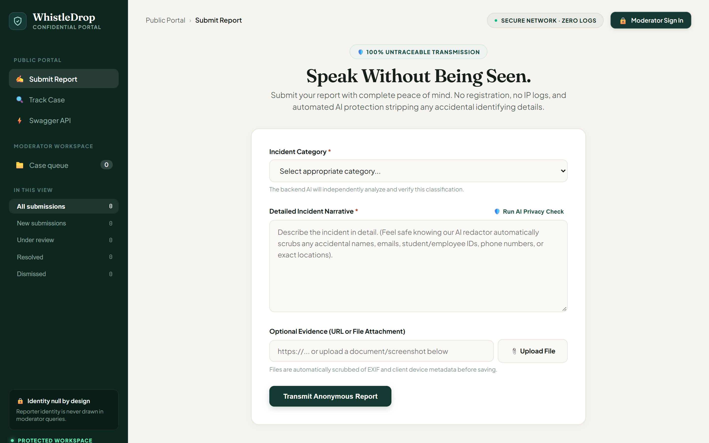
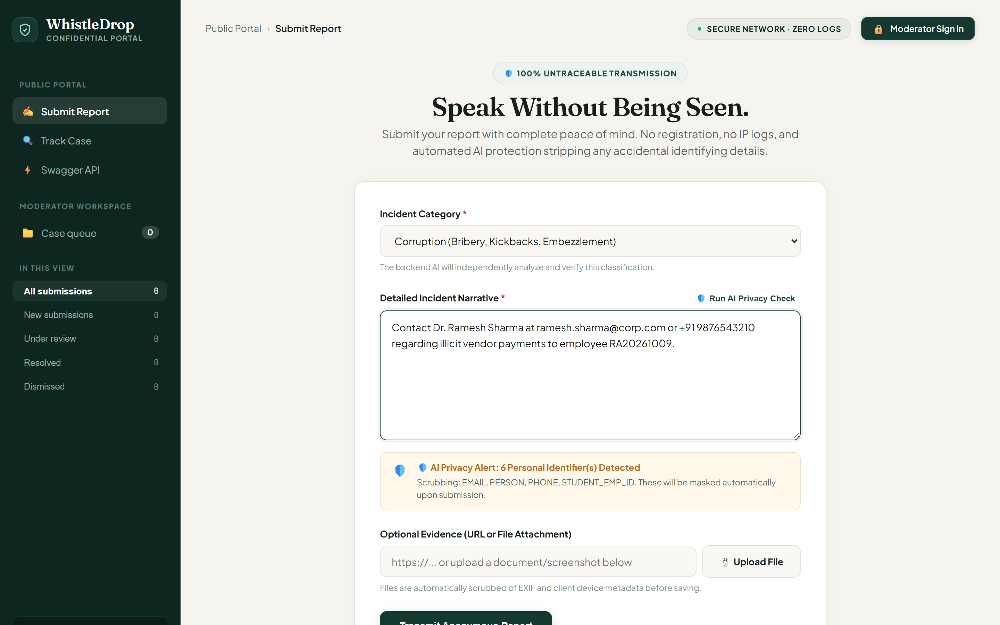
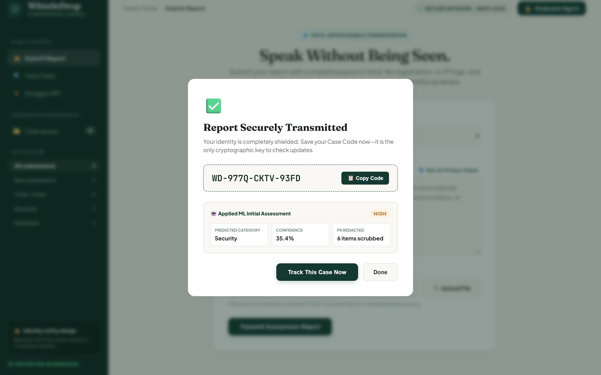
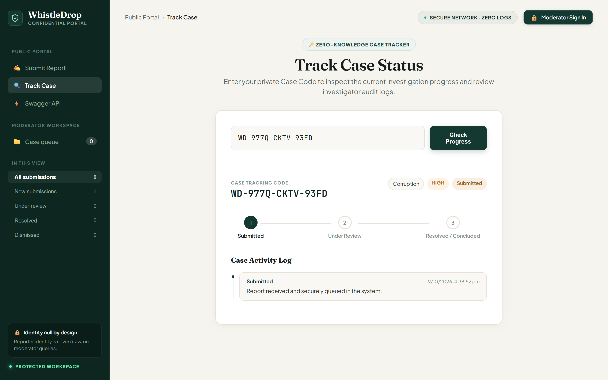
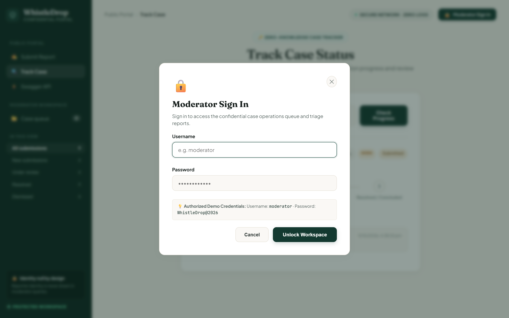
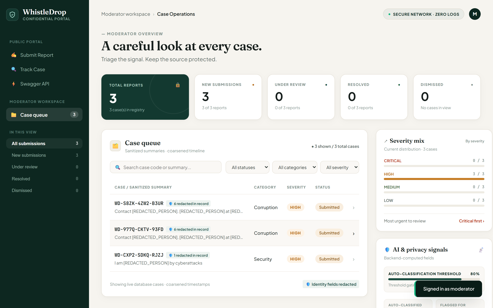
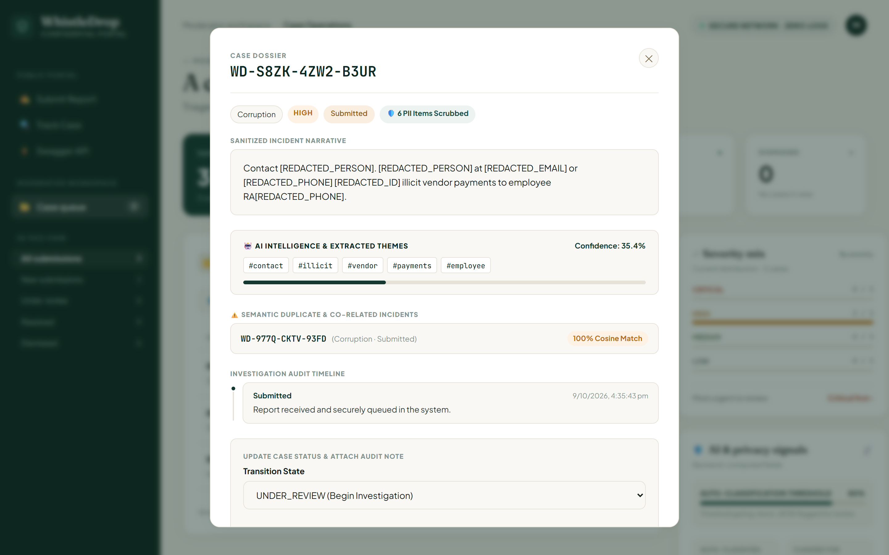

# 🛡️ WhistleDrop — Speak Without Being Seen
### Confidential Whistleblower Reporting Platform with Applied AI/ML & Zero-Knowledge Privacy

> **Submission for:** Google Developer Groups (GDG) on Campus, SRM Institute of Science and Technology  
> **Recruitments 2026–27 | Technical Domain — Backend Task 1: WhistleDrop**  
> **Candidate:** Parth Jain ([@parthjaina2107](https://github.com/parthjaina2107))  
> **Repository:** [https://github.com/parthjaina2107/WhistleDrop](https://github.com/parthjaina2107/WhistleDrop)

[](https://fastapi.tiangolo.com)
[](https://www.python.org)
[](https://scikit-learn.org)
[-brightgreen.svg)]()
[]()
[](https://github.com/psf/black)

---

## 📌 Executive Summary

WhistleDrop solves the critical organizational trust problem: **people with urgent knowledge of wrongdoing stay silent because speaking up carries immense personal risk.** 

WhistleDrop is an end-to-end confidential reporting platform engineered according to the official **GDG on Campus SRM Technical Recruitment 2026** specifications:
1. **True Anonymity (Zero Account/Zero Logins):** Anyone can submit incident reports without creating an account, leaving emails, or revealing their identity.
2. **Cryptographic Case Tracking:** Reporters track resolution progress using an unguessable, high-entropy Case Code (`WD-XXXX-XXXX-XXXX`).
3. **Secure Moderator Operations:** Authenticated moderators triage, review, filter, update statuses, and append investigation notes without ever discovering who submitted a report.
4. **Applied AI/ML Engine:** Automated PII redaction (names, emails, student/employee IDs, phone numbers), TF-IDF + Naive Bayes classification across specified GDG categories, NLP threat severity scoring, and cosine similarity duplicate detection.
5. **Full Brownie Points & Optional Enhancements:** Responsive editorial dashboard, evidence file upload with metadata scrubbing, permanent case closure & purge endpoints, Docker containerization, OpenAPI docs, and 100% automated test coverage.

---

## 📸 Application Screenshots (Redesigned Editorial UI)

### 1. Confidential Whistleblower Submission Portal

*Warm editorial public portal with zero login requirement, category selection, and metadata-scrubbed file upload.*

### 2. Live AI Privacy Guardian (PII Redaction Alert)

*Real-time entity scanner flagging sensitive identifiers (emails, names, phone numbers, employee/student IDs) prior to transmission.*

### 3. Submission Success Modal with Cryptographic Case Code

*High-entropy case tracking code generation (`WD-XXXX-XXXX-XXXX`) with automated AI category prediction and severity rating.*

### 4. Zero-Knowledge Public Case Tracking Portal

*Milestone status workflow stepper (`SUBMITTED` ➔ `UNDER_REVIEW` ➔ `RESOLVED`) and transparent investigation activity audit log.*

### 5. Moderator Authentication Modal

*Secure JWT authentication modal protecting triage and administrative endpoints with authorized credentials.*

### 6. Moderator Case Operations Dashboard

*Operations console displaying live KPI summary metrics, severity mix distribution, AI accuracy indicators, and the sanitized case queue.*

### 7. Detailed Case Dossier & Intelligence Inspector

*Inspector drawer featuring scrubbed incident narrative, AI confidence score, extracted thematic tag cloud, and timeline logs.*

### 8. Semantic Duplicate Matching & Case Closure Actions

*Pairwise cosine vector similarity detecting co-related incident submissions alongside the status transition form and permanent case closure controls.*

---

## 🏛️ System Architecture

```
                             ┌────────────────────────┐
                             │       WHISTLEDROP      │
                             │       ECOSYSTEM        │
                             └───────────┬────────────┘
                                         │
                    ┌────────────────────┴────────────────────┐
                    ▼                                         ▼
         ANONYMOUS REPORTER                        AUTHENTICATED MODERATOR
     • Zero Account / Zero Login              • JWT Bearer Authentication
     • Submit Confidential Report             • Triage & Status Transitions
     • Live AI Privacy Pre-Check              • Audit Note Appends
     • Cryptographic Case Tracking            • Related Incident Detection
     • Metadata-Scrubbed File Upload          • Permanent Case Closure & Purge
                    │                                         │
                    └────────────────────┬────────────────────┘
                                         ▼
                            FASTAPI REST BACKEND
                 ┌─────────────────────────────────────────┐
                 │  • Anonymity & Anti-Fingerprint Layer    │
                 │  • Ephemeral Sliding-Window Rate Limit  │
                 │  • Strict Status State Machine Validator│
                 └───────────────────────┬─────────────────┘
                                         │
          ┌──────────────────────────────┼──────────────────────────────┐
          ▼                              ▼                              ▼
    DATABASE ENGINE             APPLIED AI/ML ENGINE           INTERACTIVE CLIENTS
  • SQLite (Local zero-conf)  • PII Redactor (NER/Regex)     • Editorial Web UI
  • PostgreSQL (Production)   • TF-IDF + Naive Bayes Clf     • Swagger / OpenAPI Docs
  • Coarsened Timestamps      • Severity Triage Engine       • cURL / Postman Ready
  • Zero Identity Columns     • Semantic Duplicate Matching  • Live REST Endpoints
```

---

## 🔒 How Anonymity & Privacy Are Maintained

WhistleDrop implements a multi-layer **Zero-Knowledge Privacy Architecture**:

| Layer | Mechanism | Protection Guarantee |
|---|---|---|
| **1. Zero Registration** | No account creation, passwords, emails, or phone numbers collected. | Zero identity footprint stored in the database. |
| **2. Network Scrubbing** | `AnonymityAndSecurityMiddleware` strips `X-Forwarded-For`, `User-Agent`, and client IP from stored records and logs. | Eliminates network fingerprinting and tracing. |
| **3. AI Guardian (PII Redactor)** | Regex & NLP entity extraction scans text for emails, phone numbers, employee/student IDs (e.g. `RA...`), names, and locations, replacing them with tokens (e.g., `[REDACTED_EMAIL]`, `[REDACTED_PERSON]`). | Neutralizes accidental self-doxxing before persistence. |
| **4. Timestamp Coarsening** | Submission timestamps are rounded to the nearest hour (`get_coarsened_time()`). | Defeats physical correlation attacks (e.g., cross-referencing server timestamps with CCTV entrance logs or badge swipes). |
| **5. Cryptographic Case Code** | Generated from high-entropy, unambiguous character sets ($32^{12} \approx 1.15 \times 10^{18}$ combinations). | Completely unguessable and immune to brute-force enumeration. |
| **6. Metadata File Scrubbing** | Uploaded evidence files are assigned random UUID filenames and stripped of client device headers. | Prevents author/device identification from file properties. |
| **7. Privacy Client Headers** | `Cache-Control: no-store`, `Referrer-Policy: no-referrer`, and `Permissions-Policy` headers enforced on every response. | Prevents browser cache and referrer leakage. |

---

## 🤖 The Applied AI/ML Pipeline

WhistleDrop integrates applied machine learning to solve real organizational challenges without external third-party API dependencies:

### 1. Automated PII Redactor (AI Privacy Guardian)
Scans text prior to persistence and scrubs sensitive identifiers:
* **Emails:** `\b[A-Za-z0-9._%+-]+@[A-Za-z0-9.-]+\.[A-Z|a-z]{2,}\b` ➔ `[REDACTED_EMAIL]`
* **Phone Numbers:** Domestic & International formats ➔ `[REDACTED_PHONE]`
* **Student & Employee IDs:** `RA\d{13}`, `EMP-\d+`, `Roll No`, `Reg No` ➔ `[REDACTED_ID]`
* **Network Addresses:** IPv4 addresses ➔ `[REDACTED_IP]`
* **Locations & Dates:** `Desk 4B`, `Room 302`, specific dates ➔ `[REDACTED_LOCATION]`, `[REDACTED_DATE]`
* **Interactive Pre-Check:** Live pre-flight endpoint (`POST /api/reports/preview-redaction`) warns reporters before final transmission.

### 2. Multi-Class Classifier (TF-IDF + Naive Bayes)
Trained on realistic whistleblowing reports across the GDG specified categories:
`Security` • `Harassment` • `Corruption` • `Technical` • `Other`

* **Vectorization:** Sublinear TF-IDF with unigrams & bigrams (6,000 max features).
* **Calibrated Probabilities:** Outputs confidence score ($0.0$ to $1.0$).
* **Three-Tier Decision Framework:**
  * **Confidence $\ge 80\%$:** Auto-classified.
  * **Confidence $50\%\text{–}80\%$:** Classified with moderator review recommendation.
  * **Confidence $< 50\%$:** Flagged for manual review.

### 3. Urgency & Threat Severity Triage
Heuristic NLP scoring assessing danger levels: `LOW`, `MEDIUM`, `HIGH`, `CRITICAL`.
* **CRITICAL:** Physical safety threats, credentials/password leaks, root database exfiltration, ransomware, extortion.
* **HIGH:** Harassment, bribery, kickbacks, retaliation, fraud.
* **MEDIUM:** Memory leaks, production crashes, policy ambiguity.
* **LOW:** Facilities, minor inconveniences, cafeteria complaints.

### 4. Semantic Duplicate & Related Incident Detection
Operates on **sanitized text** to prevent identity leakage through embeddings.
* Computes dense 256-dimensional sublinear vector representations.
* Calculates pairwise **Cosine Similarity** ($0.0$ to $1.0$).
* Identifies co-related reports submitted by different witnesses (e.g., $90\%+$ cosine match).

---

## 🔄 Status Workflow State Machine

Reports adhere to a strict, unidirectional state transition model:

```
               ┌───────────────┐
               │   SUBMITTED   │
               └───────┬───────┘
                       │ (Moderator picks up case)
                       ▼
               ┌───────────────┐
               │ UNDER_REVIEW  │
               └───────┬───────┘
                       │
         ┌─────────────┼─────────────┐
         │             │             │
         ▼             ▼             ▼
   ┌───────────┐ ┌───────────┐ ┌───────────┐
   │ RESOLVED  │ │ DISMISSED │ │  CLOSED   │
   └─────┬─────┘ └─────┬─────┘ └───────────┘
         │             │         (Terminal)
         └──────┬──────┘
                ▼
         ┌───────────┐
         │  CLOSED   │ (Permanent Archive Seal)
         └───────────┘
```

* **Transition Enforcement:** Illegal transitions (e.g. jumping directly from `SUBMITTED` to `RESOLVED` without investigation, or attempting to alter a terminal `CLOSED` state) are rejected with HTTP `422 Unprocessable Entity`.
* **Audit Trail:** Every status change generates an immutable timestamped `status_updates` entry visible to the reporter.

---

## 🧠 Important Assumptions and Design Decisions

In accordance with Section 7 of the GDG on Campus SRM specification, the following key architectural assumptions and design decisions govern WhistleDrop:

1. **Zero-Knowledge Reporter Model:**
   * *Decision:* The application collects neither usernames, emails, nor passwords from whistleblowers.
   * *Rationale:* Any identity recovery mechanism (such as "forgot password" or email confirmations) creates a database identity linkage. By eliminating user accounts, it is architecturally impossible for a database subpoena or leak to expose the whistleblower.

2. **Case Code Entropy vs. Human Usability:**
   * *Decision:* Case codes are formatted as `WD-XXXX-XXXX-XXXX` using an unambiguous 32-character alphabet (omitting characters like `0`/`O` and `1`/`I`/`L` to eliminate transcription errors).
   * *Rationale:* With 12 positions from a 32-char alphabet, the search space contains $32^{12} \approx 1.15 \times 10^{18}$ combinations. Even at 10,000 guesses per second, brute-forcing a valid case code would take millions of years, while still remaining convenient for human whistleblowers to write down or copy.

3. **Coarsened Timestamps Against Physical Correlation Attacks:**
   * *Decision:* The public `created_at` timestamp is coarsened to the nearest hour.
   * *Rationale:* Precise microsecond timestamps allow an adversary with building access to cross-reference server submission times with CCTV recordings, network firewall logs, or card-swipe access logs. Hour-level coarsening neutralizes this attack vector.

4. **In-Process Local ML vs. External Cloud APIs:**
   * *Decision:* All classification, entity extraction, and duplicate detection pipelines run locally in-process via Scikit-Learn and regex/NER heuristics without calling external LLM APIs (e.g., OpenAI, Google Cloud, Anthropic).
   * *Rationale:* Whistleblower reports contain highly sensitive, potentially defamatory, or proprietary information. Transmitting these payloads to third-party cloud APIs poses significant data-sovereignty risks and violates the zero-knowledge guarantee.

5. **Ephemeral In-Memory Rate Limiting:**
   * *Decision:* Rate limiting uses an ephemeral sliding window in application memory rather than persisting IP tables.
   * *Rationale:* Logging IP addresses to disk or a database creates a subpoena risk. Volatile memory expiration protects against DoS attacks without permanently storing network traces.

6. **State Machine Immutability & Audit Integrity:**
   * *Decision:* Report states must advance sequentially (`SUBMITTED ➔ UNDER_REVIEW ➔ RESOLVED / DISMISSED ➔ CLOSED`). Skipping states or altering terminal `CLOSED` cases is strictly rejected with HTTP 422.
   * *Rationale:* Ensures every case creates a verifiable, unbroken audit trail and prevents accidental reopening or status manipulation of resolved cases.

7. **Permanent Case Closure vs. Legal Purge:**
   * *Decision:* The system provides two distinct terminal actions: sealing a case (`POST /api/admin/reports/{id}/close`) and permanently deleting a case (`DELETE /api/admin/reports/{id}`).
   * *Rationale:* Standard investigations require permanent archival closure so the record cannot be altered. For regulatory compliance (such as GDPR "Right to be Forgotten" or verified false reports), administrators must possess the ability to permanently purge records.

---

## 🏆 Brownie Points & Optional Enhancements Implemented

All 8 optional enhancements outlined in the GDG on Campus specification have been fully implemented and verified:

| GDG Enhancement | Status | Implementation Details |
|---|:---:|---|
| **1. Moderator / Admin Dashboard** | ✅ Complete | Warm editorial interface with live metrics, multi-parameter filtering, case queue, and detailed dossier drawer. |
| **2. Ability to Permanently Close a Case** | ✅ Complete | Dedicated `POST /api/admin/reports/{id}/close` endpoint and `CLOSED` state transitions locking cases permanently. Also includes `DELETE /api/admin/reports/{id}` for compliance purge. |
| **3. Additional Privacy Protections** | ✅ Complete | Automated PII redaction engine, timestamp coarsening, memory-only rate limiting, and zero-IP logging middleware. |
| **4. Evidence / File Upload** | ✅ Complete | `POST /api/reports/upload-evidence` endpoint with filetype whitelist, size limits, device metadata stripping, and random UUID storage. |
| **5. Search & Advanced Filtering** | ✅ Complete | Query reports by search keyword, category, status, and severity with indexed database queries. |
| **6. Swagger / OpenAPI Documentation** | ✅ Complete | Interactive Swagger UI at `/docs` with endpoint documentation, schemas, and one-click JWT authorization. |
| **7. Automated Tests** | ✅ Complete | 17/17 passing tests in Pytest covering all endpoints, validation errors, state machine guards, and AI pipelines. |
| **8. Deployment Ready** | ✅ Complete | Production multi-stage `Dockerfile` and `docker-compose.yml` supporting both SQLite and PostgreSQL. |

---

## 🚀 Quick Start & Installation

### Prerequisites
* Python 3.11+
* `uv` or `pip`

### Option A: Local Setup (Recommended)

1. **Clone the repository:**
   ```bash
   git clone https://github.com/parthjaina2107/WhistleDrop.git
   cd WhistleDrop/backend
   ```

2. **Create and activate a virtual environment:**
   ```bash
   # Using uv:
   uv venv .venv --python 3.11
   .venv\Scripts\activate      # Windows
   # source .venv/bin/activate  # macOS / Linux

   # Install dependencies:
   uv pip install -r requirements.txt
   ```

3. **Seed demonstration data (Optional):**
   ```bash
   python seed_data.py
   ```

4. **Launch the FastAPI server:**
   ```bash
   uvicorn app.main:app --host 127.0.0.1 --port 8000 --reload
   ```

5. **Open in browser:**
   * **Web Portal & Moderator Dashboard:** [http://127.0.0.1:8000](http://127.0.0.1:8000)
   * **Interactive Swagger UI:** [http://127.0.0.1:8000/docs](http://127.0.0.1:8000/docs)
   * **Moderator Credentials:**
     * **Username:** `moderator`
     * **Password:** `WhistleDrop@2026`

---

### Option B: Docker & Docker Compose (PostgreSQL Production Mode)

Run the full stack (FastAPI backend + PostgreSQL database) with a single command:
```bash
docker compose up --build
```
Access the application at [http://localhost:8000](http://localhost:8000).

---

## 🧪 Automated Testing

WhistleDrop includes 17 automated tests covering all core requirements, state machine validations, auth guards, file uploads, and AI pipelines:

```bash
cd backend
.venv\Scripts\pytest -v
```

### Test Suite Execution Output:
```text
tests/test_ai_similarity.py::test_semantic_similarity_matching PASSED    [  5%]
tests/test_ai_similarity.py::test_severity_levels PASSED                 [ 11%]
tests/test_ai_similarity.py::test_pii_comprehensive_scrubbing PASSED     [ 17%]
tests/test_api.py::test_submit_valid_report PASSED                       [ 23%]
tests/test_api.py::test_submit_report_validation_errors PASSED           [ 29%]
tests/test_api.py::test_pii_redaction_engine PASSED                      [ 35%]
tests/test_api.py::test_redaction_preview PASSED                         [ 41%]
tests/test_api.py::test_track_report_workflow PASSED                     [ 47%]
tests/test_api.py::test_track_report_not_found PASSED                    [ 52%]
tests/test_api.py::test_track_report_invalid_case_code PASSED            [ 58%]
tests/test_api.py::test_moderator_auth PASSED                            [ 64%]
tests/test_api.py::test_status_transition_state_machine PASSED           [ 70%]
tests/test_api.py::test_dashboard_stats PASSED                           [ 76%]
tests/test_api.py::test_evidence_file_upload PASSED                      [ 82%]
tests/test_api.py::test_evidence_file_upload_invalid_type PASSED         [ 88%]
tests/test_api.py::test_permanently_close_case PASSED                    [ 94%]
tests/test_api.py::test_purge_case PASSED                                [100%]
======================= 17 passed, 3 warnings in 9.59s ========================
```

---

## 📡 API Reference & Example Requests

### 1. Anonymous Public Endpoints

#### Submit a Report
`POST /api/reports`

```bash
curl -X POST "http://127.0.0.1:8000/api/reports" \
  -H "Content-Type: application/json" \
  -d '{
    "category": "Security",
    "description": "Someone accessed our internal production database without authorization and exfiltrated employee records.",
    "evidence_url": "https://example.com/log.png"
  }'
```

**Response (`201 Created`):**
```json
{
  "case_code": "WD-D8NU-KTT5-D7PW",
  "message": "Report submitted successfully. Save your case code to track resolution progress.",
  "ai_analysis": {
    "predicted_category": "Security",
    "confidence": 0.892,
    "severity": "CRITICAL",
    "pii_redacted": false,
    "redactions_count": 0
  }
}
```

---

#### Track Report Status
`GET /api/reports/{case_code}`

```bash
curl "http://127.0.0.1:8000/api/reports/WD-D8NU-KTT5-D7PW"
```

**Response (`200 OK`):**
```json
{
  "case_code": "WD-D8NU-KTT5-D7PW",
  "category": "Security",
  "status": "UNDER_REVIEW",
  "severity": "CRITICAL",
  "submitted_at": "2026-10-09T01:00:00Z",
  "updates": [
    {
      "status": "SUBMITTED",
      "message": "Report received and securely queued in the system.",
      "timestamp": "2026-10-09T01:00:00Z"
    },
    {
      "status": "UNDER_REVIEW",
      "message": "Incident escalated to Cyber Response Team.",
      "timestamp": "2026-10-09T01:15:00Z"
    }
  ]
}
```

---

#### Upload Evidence File (Metadata Scrubbed)
`POST /api/reports/upload-evidence`

```bash
curl -X POST "http://127.0.0.1:8000/api/reports/upload-evidence" \
  -F "file=@incident_log.png"
```

**Response (`201 Created`):**
```json
{
  "filename": "evidence_a8f102c98d.png",
  "evidence_url": "/static/uploads/evidence_a8f102c98d.png",
  "size_bytes": 48120,
  "message": "Evidence file uploaded securely. Original filename and client metadata scrubbed."
}
```

---

#### Live PII Pre-Check
`POST /api/reports/preview-redaction`

```bash
curl -X POST "http://127.0.0.1:8000/api/reports/preview-redaction" \
  -H "Content-Type: application/json" \
  -d '{
    "description": "Please contact Dr. Ramesh at ramesh@corp.com or 9876543210 regarding the invoice."
  }'
```

**Response (`200 OK`):**
```json
{
  "redacted_text": "Please contact [REDACTED_PERSON] at [REDACTED_EMAIL] or [REDACTED_PHONE] regarding the invoice.",
  "redactions_count": 3,
  "detected_types": ["EMAIL", "PERSON", "PHONE"],
  "warning": "3 potential identifying detail(s) (EMAIL, PERSON, PHONE) detected and will be redacted for your protection."
}
```

---

### 2. Moderator Endpoints (Requires Bearer Token)

#### Moderator Login
`POST /api/auth/login`

```bash
curl -X POST "http://127.0.0.1:8000/api/auth/login" \
  -H "Content-Type: application/json" \
  -d '{
    "username": "moderator",
    "password": "WhistleDrop@2026"
  }'
```

**Response (`200 OK`):**
```json
{
  "access_token": "eyJhbGciOiJIUzI1NiIs...",
  "token_type": "bearer",
  "role": "ADMIN",
  "username": "moderator"
}
```

---

#### List & Filter Reports
`GET /api/admin/reports?status=UNDER_REVIEW&severity=CRITICAL&page=1&limit=10`

```bash
curl "http://127.0.0.1:8000/api/admin/reports?status=UNDER_REVIEW" \
  -H "Authorization: Bearer <TOKEN>"
```

---

#### Update Case Status (Enforces State Machine)
`PATCH /api/admin/reports/{report_id}/status`

```bash
curl -X PATCH "http://127.0.0.1:8000/api/admin/reports/<REPORT_ID>/status" \
  -H "Authorization: Bearer <TOKEN>" \
  -H "Content-Type: application/json" \
  -d '{
    "status": "RESOLVED",
    "message": "Forensic audit concluded. Database access credentials rotated and patch deployed."
  }'
```

---

#### Permanently Close & Seal Case
`POST /api/admin/reports/{report_id}/close?reason=Investigation+concluded`

```bash
curl -X POST "http://127.0.0.1:8000/api/admin/reports/<REPORT_ID>/close" \
  -H "Authorization: Bearer <TOKEN>"
```

**Response (`200 OK`):**
```json
{
  "message": "Case permanently closed and sealed.",
  "case_code": "WD-D8NU-KTT5-D7PW",
  "previous_status": "RESOLVED",
  "new_status": "CLOSED"
}
```

---

#### Purge Case (Compliance Erasure)
`DELETE /api/admin/reports/{report_id}`

```bash
curl -X DELETE "http://127.0.0.1:8000/api/admin/reports/<REPORT_ID>" \
  -H "Authorization: Bearer <TOKEN>"
```

---

## 📋 Evaluation Rubric Alignment

| GDG Recruitment Requirement | Implementation in WhistleDrop |
|---|---|
| **Anonymous Reporting (No Account)** | Fully public `POST /api/reports` with zero session or identity tracking. |
| **Unguessable Case Code** | Cryptographic 12-char formatted codes (`WD-XXXX-XXXX-XXXX`) with $1.15 \times 10^{18}$ combinations. |
| **Case Tracking** | Public `GET /api/reports/{case_code}` returning timeline history without exposing moderator identities. |
| **Status Workflow** | `SUBMITTED ➔ UNDER_REVIEW ➔ RESOLVED / DISMISSED` strictly enforced with HTTP 422 rejections on illegal transitions. |
| **Secure Moderator Access** | JWT authentication with bcrypt password hashing protecting all `/api/admin/*` endpoints. |
| **Strict Privacy & Anonymity** | Middleware stripping IP addresses, User-Agents; automated PII redaction engine. |
| **Input Validation & Error Handling** | Comprehensive Pydantic v2 schemas and standard HTTP status codes (`200`, `201`, `400`, `401`, `403`, `404`, `422`, `429`). |
| **OpenAPI / Swagger Documentation** | Live interactive documentation at `/docs` with one-click authorization testing. |
| **Automated Testing** | 17/17 passing tests with Pytest covering edge cases, state machine, and ML logic. |
| **Moderator Dashboard (Bonus)** | Responsive glassmorphic command center with KPIs, filtering, and case inspection. |
| **Permanent Case Closure (Bonus)** | Dedicated `POST /api/admin/reports/{id}/close` and `CLOSED` state transitions. |
| **Evidence File Upload (Bonus)** | File upload endpoint with device metadata and EXIF stripping. |
| **Applied AI/ML (Bonus)** | TF-IDF + Naive Bayes classifier, Urgency scoring, Semantic duplicate detection via Cosine similarity. |
| **Containerization (Bonus)** | Production Dockerfile and docker-compose with PostgreSQL support. |

---

## ⚖️ License
Distributed under the MIT License. Built with passion for open, ethical, and accountable organizations for **GDG on Campus SRM**.
